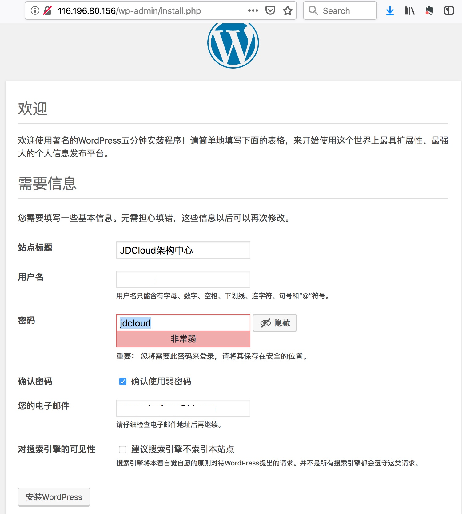

基于京东云云主机和数据库服务搭建WordPress网站


# 前提条件

已创建云主机，并能通过SSH进行访问。

# 安装Nginx和PHP环境

## 安装Nginx
首先更新云主机yum源
```bash
[root@srv011 ~]#  yum upgrade
```
安装Nginx，将自动创建名为nginx的账号和账号组，并创建nginxNginx服务，该服务以nginx账号身份运行。
```bash
[root@srv011 ~]# yum install nginx -y
[root@srv011 ~]# id nginx
uid=996(nginx) gid=994(nginx) groups=994(nginx)
[root@srv011 ~]# chkconfig nginx on
[root@srv011 ~]# service nginx start
Redirecting to /bin/systemctl start nginx.service
[root@srv011 ~]# service nginx status
Redirecting to /bin/systemctl status nginx.service
● nginx.service - The nginx HTTP and reverse proxy server
   Loaded: loaded (/usr/lib/systemd/system/nginx.service; enabled; vendor preset: disabled)
   Active: active (running) since Tue 2018-10-30 15:10:22 CST; 1s ago
  Process: 1412 ExecStart=/usr/sbin/nginx (code=exited, status=0/SUCCESS)
  Process: 1409 ExecStartPre=/usr/sbin/nginx -t (code=exited, status=0/SUCCESS)
  Process: 1407 ExecStartPre=/usr/bin/rm -f /run/nginx.pid (code=exited, status=0/SUCCESS)
 Main PID: 1414 (nginx)
   CGroup: /system.slice/nginx.service
           ├─1414 nginx: master process /usr/sbin/nginx
           ├─1415 nginx: worker process
           └─1416 nginx: worker process

Oct 30 15:10:22 srv011 systemd[1]: Starting The nginx HTTP and reverse proxy server...
Oct 30 15:10:22 srv011 nginx[1409]: nginx: the configuration file /etc/nginx/nginx.conf syntax is ok
Oct 30 15:10:22 srv011 nginx[1409]: nginx: configuration file /etc/nginx/nginx.conf test is successful
Oct 30 15:10:22 srv011 systemd[1]: Started The nginx HTTP and reverse proxy server.
```
通过执行curl命令验证Nginx运行是否正常，并访问缺省的页面。
```bash
[root@srv011 ~]# curl http://localhost -I
HTTP/1.1 200 OK
Server: nginx/1.12.2
Date: Tue, 30 Oct 2018 07:15:19 GMT
Content-Type: text/html
Content-Length: 3700
Last-Modified: Tue, 06 Mar 2018 09:26:21 GMT
Connection: keep-alive
ETag: "5a9e5ebd-e74"
Accept-Ranges: bytes
[root@srv011 ~]# curl http://localhost
```
获得如下HTML页面信息，可发现缺省的配置文件是/etc/nginx/nginx.conf，文档根目录是/usr/share/nginx/html
```html
<div class="content">
    <p>This is the default <tt>index.html</tt> page that
    is distributed with <strong>nginx</strong> on
    Fedora.  It is located in
    <tt>/usr/share/nginx/html</tt>.</p>

    <p>You should now put your content in a location of
    your choice and edit the <tt>root</tt> configuration
    directive in the <strong>nginx</strong>
    configuration file
    <tt>/etc/nginx/nginx.conf</tt>.</p>
</div>
```
## 配置PHP模块
WordPress是基于PHP的架构，因此需要配置php-fp作为FastCGI后台程序运行。下面是需要安装的模块。
* php-fpm: PHP FastCGI Process Manager
* php: A module for PHP applications that use MySQL databases
* php-cli: Command-line interface for PHP
```bash
[root@srv011 html]# yum -y install php-fpm php-mysql php-cli
Loaded plugins: fastestmirror, langpacks
Repository base is listed more than once in the configuration

[root@srv011 html]# chkconfig php-fpm on
Note: Forwarding request to 'systemctl enable php-fpm.service'.
Created symlink from /etc/systemd/system/multi-user.target.wants/php-fpm.service to /usr/lib/systemd/system/php-fpm.service.
[root@srv011 html]# 
```
编辑PHP-FPM配置文件/etc/php-fpm.d/www.conf, 让PHP FastCGI Process Manager以nginx账户身份去访问文件。原文件内容为：
```ini
; RPM: apache Choosed to be able to access some dir as httpd
user = apache
; RPM: Keep a group allowed to write in log dir.
group = apache
```
修改后到文件内容为：
```ini
; RPM: apache Choosed to be able to access some dir as httpd
user = nginx
; RPM: Keep a group allowed to write in log dir.
group = nginx
```
在/usr/share/nginx/html/目录下创建phpinfo.php，内容如下：
```php
<?php phpinfo();?>
```
此时，执行如下命令，发现nginx并没有把php文件发送给后台的php-fpm模块，原因是我们还没有完成nginx.conf的配置，把PHP文件请求发送给PHP FPM。
```bash
[root@srv011 html]# curl http://localhost/phpinfo.php
<?php phpinfo();?>
```

修改/etc/nginx/nginx.conf
```php
        # pass the PHP scripts to FastCGI server listening on 127.0.0.1:9000
        #
        location ~ \.php$ {
            root           /usr/share/nginx/html;
            fastcgi_pass   127.0.0.1:9000;
            fastcgi_index  index.php;
            fastcgi_param  SCRIPT_FILENAME $document_root$fastcgi_script_name;
            include        fastcgi_params;
        }
```
在重新启动nginx服务后，将看到如下信息（特别是X-Powered-By: PHP/5.4.16），表示nginx和php的集成配置成功。
```bash
[root@srv011 nginx]# curl http://localhost/phpinfo.php -I
HTTP/1.1 200 OK
Server: nginx/1.12.2
Date: Tue, 30 Oct 2018 07:47:36 GMT
Content-Type: text/html
Connection: keep-alive
X-Powered-By: PHP/5.4.16
```

# 配置MySQL数据库
WordPress所采用的MySQL数据库采用京东云提供的RDS-MySQL服务，当然也可以自行在云主机上安装MySQL服务。基于京东云RDS-MySQL服务，可缩短数据库的安装和配置时间，并提供自动备份、监控以及恢复等功能。

## 创建MySQL数据库
在京东云控制台创建RDS实例时，需选择正确的VPC和子网，并完成如下配置：
* 配置访问白名单，用户运行WordPress的云主机能访问RDS
* 创建数据库wordpress
* 创建用户user001，设置口令，给该用户分配wordpress数据库的读写权限。
 
下面在云主机上安装MySQL客户端，并验证能正常访问创建的MySQL数据库。下述命令中，jddb-cn-north-1-fd9a1be6a9e34f0c.jcloud.com是创建RDS实例后提供的内网访问地址，user001是创建的用户，wordpress是创建的数据库。

CentOS 7的默认YUM源中是MariaDB，而不是我们常用的MySQL。 
## 验证通过客户端访问数据库
```bash
[root@srv011 ~]# wget http://repo.mysql.com/mysql57-community-release-el7.rpm
--2018-10-31 14:13:56--  http://repo.mysql.com/mysql57-community-release-el7.rpm
Resolving repo.mysql.com (repo.mysql.com)... 104.118.86.179
Connecting to repo.mysql.com (repo.mysql.com)|104.118.86.179|:80... connected.
HTTP request sent, awaiting response... 200 OK
Length: 25680 (25K) [application/x-redhat-package-manager]
Saving to: ‘mysql57-community-release-el7.rpm’

100%[========================================================>] 25,680       137KB/s   in 0.2s   

2018-10-31 14:13:56 (137 KB/s) - ‘mysql57-community-release-el7.rpm’ saved [25680/25680]

[root@srv011 ~]# rpm -ivh mysql57-community-release-el7.rpm
warning: mysql57-community-release-el7.rpm: Header V3 DSA/SHA1 Signature, key ID 5072e1f5: NOKEY
Preparing...                          ################################# [100%]
Updating / installing...
   1:mysql57-community-release-el7-11 ################################# [100%]

[root@srv011 ~]# yum install -y mysql-server

[root@srv011 ~]#  mysql -u user001 -p -h jddb-cn-north-1-fd9a1be6a9e34f0c.jcloud.com
Enter password: 
Welcome to the MySQL monitor.  Commands end with ; or \g.
Your MySQL connection id is 1419
Server version: 5.7.21-log Source distribution

Copyright (c) 2000, 2018, Oracle and/or its affiliates. All rights reserved.

Oracle is a registered trademark of Oracle Corporation and/or its
affiliates. Other names may be trademarks of their respective
owners.

Type 'help;' or '\h' for help. Type '\c' to clear the current input statement.

```

# 安装wordpress

## 下载Wordpress安装包
访问[https://cn.wordpress.org/download/]网站，可获得最新的中文版本。下面现在最新的WordPress中文版，并解压缩到/opt目录下。

```bash
[root@srv011 ~]# wget https://cn.wordpress.org/wordpress-4.9.4-zh_CN.tar.gz
--2018-10-31 10:25:34--  https://cn.wordpress.org/wordpress-4.9.4-zh_CN.tar.gz
Resolving cn.wordpress.org (cn.wordpress.org)... 198.143.164.252
Connecting to cn.wordpress.org (cn.wordpress.org)|198.143.164.252|:443... connected.
HTTP request sent, awaiting response... 200 OK
Length: 9082696 (8.7M) [application/octet-stream]
Saving to: ‘wordpress-4.9.4-zh_CN.tar.gz’

100%[======================================>] 9,082,696   3.48MB/s   in 2.5s   

2018-10-31 10:25:38 (3.48 MB/s) - ‘wordpress-4.9.4-zh_CN.tar.gz’ saved [9082696/9082696]

[root@srv011 opt]# tar zxvf /root/wordpress-4.9.8.tar.gz 
wordpress/
wordpress/xmlrpc.php
wordpress/wp-blog-header.php
```
然后修改文件拥有者为nginx。
```bash
[root@srv011 opt]# chown -R nginx:nginx wordpress
```

## 修改wordpress配置文件

```bash
[root@srv011 wordpress]# cp wp-config-sample.php wp-config.php
```
修改配置文件wp-config.php，设置数据访问信息。
```php
// ** MySQL 设置 - 具体信息来自您正在使用的主机 ** //
/** WordPress数据库的名称 */
define('DB_NAME', 'wordpress');

/** MySQL数据库用户名 */
define('DB_USER', 'user001');

/** MySQL数据库密码 */
define('DB_PASSWORD', 'Passw0rd');

/** MySQL主机 */
define('DB_HOST', 'jddb-cn-north-1-fd9a1be6a9e34f0c.jcloud.com');
```
在完成上述配置后，重新启动nginx和php-fpm服务，在浏览器中访问地址http://116.196.80.156/wp-admin/install.php, 将显示如下信息：

在上图中输入必要的信息（包括站点标题、用户名、密码等）,点击[安装WordPress]，将完成安装。此时，访问MySQL数据库，将看到已经生成如下表。
```SQL
[root@srv011 wordpress]# mysql -u user001 -p -h jddb-cn-north-1-fd9a1be6a9e34f0c.jcloud.com
Enter password: 
Welcome to the MariaDB monitor.  Commands end with ; or \g.
Your MySQL connection id is 2534976
Server version: 5.7.21-log Source distribution

Copyright (c) 2000, 2018, Oracle, MariaDB Corporation Ab and others.

Type 'help;' or '\h' for help. Type '\c' to clear the current input statement.

MySQL [(none)]> use wordpress;
Database changed
MySQL [wordpress]> show tables;
Empty set (0.01 sec)

MySQL [wordpress]> show tables;
+-----------------------+
| Tables_in_wordpress   |
+-----------------------+
| wp_commentmeta        |
| wp_comments           |
| wp_links              |
| wp_options            |
| wp_postmeta           |
| wp_posts              |
| wp_term_relationships |
| wp_term_taxonomy      |
| wp_termmeta           |
| wp_terms              |
| wp_usermeta           |
| wp_users              |
+-----------------------+
12 rows in set (0.00 sec)
```

# 发布第一篇博客
访问http://116.196.80.156/wp-login.php地址，用在前一步设置的用户名和口令登录到WordPress，完成基本配置，并创建第一篇文章。

* 在【外观】-> 【主题】页面，启动“Twenty Sixteen“主题，并更新到最新版本
* 在【插件】界面，选择添加插件，安装"Markdown Editor“。如在线安装失败，可先下载插件，然后通过upload插件进行安装。
* 在【Settiings】-> 【撰写】页面，启动"MarkDown“选项
* 